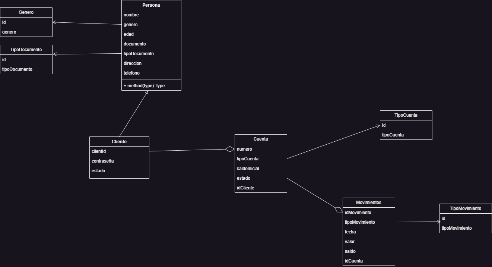

# Sistema de Banca, gestión de Clientes, Cuenta y Movimientos

En esta versión se diseñó el diagrama de clases anterior.

En el desarrollo como primera versión se desarrollaron clases más simples al diagrama planteado,
ya que se presentaban inconsistencias a la hora de utilizar JPA para los casos de clases heredadas.

Se busco crear una aplicación funcional, modulada en capaz, según los casos y aplicando relaciones simples entre las clases que así lo requerían.

Como mejoras queda pendiente agregar.
Capa de Dto para el manejo de datos del Controller y una clase Mapper respectiva a cada modelo, para las conversiones requeridas a la hora de trabajar controller y servicios.
Capa de excepciones personalizadas para capturar determinados errores posibles.
Crear clase Persona como clase Madre de Cliente y reflejarlo en el mapeo de datos en la base con JPA.

Se adjunta el archivo, Banco.postman_collection.json con las pruebas ejecutadas.

Se utilizó como Base de Datos Postgres con el nombre "Bank" para la base.
Creando la Base de datos, las tablas se crean a la hora de ejecutarse el programa.
Está configurado en modo update, para que se mantenga la estructura y solamente se actualice en el caso de requerir cambios en las tablas.
